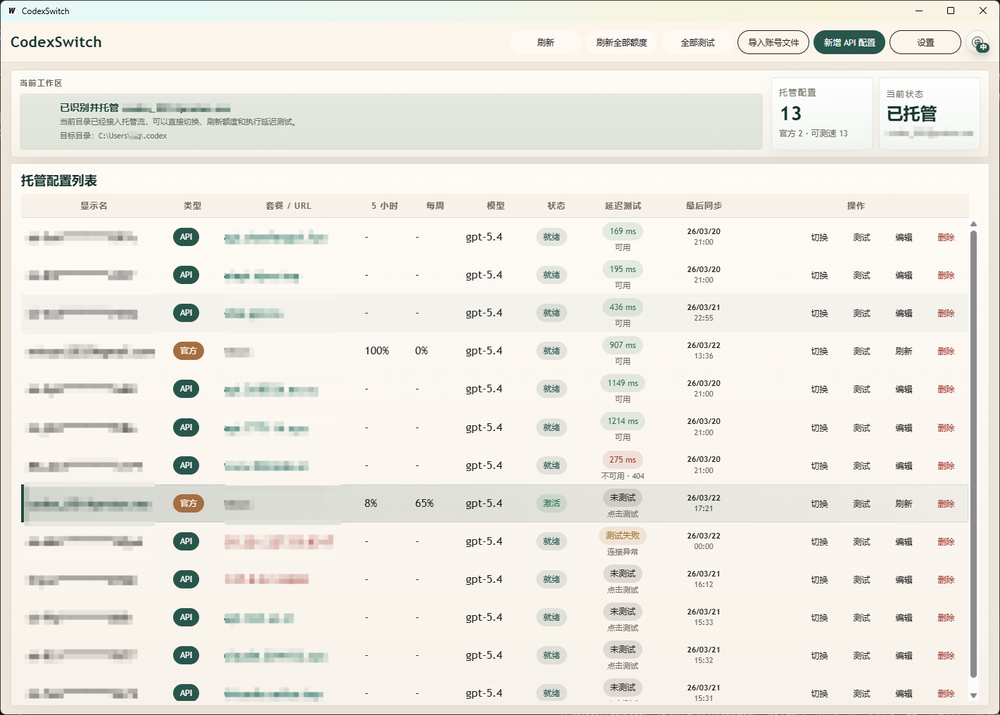

<p align="right">
  <strong>简体中文</strong> | <a href="./README.en.md">English</a>
</p>

# CodexSwitch

<p align="center">
  
</p>

<p align="center">
  <strong>Codex 配置管理器 / Codex 账号切换器 / OpenAI API 配置切换桌面工具</strong>
</p>

<p align="center">
  
  
  
  
  
  
</p>

<p align="center">
  
  
  
  
  
</p>

<p align="center">
  <a href="https://github.com/ke4nec/CodexSwitch/releases"></a>
  <a href="https://github.com/ke4nec/CodexSwitch/stargazers"></a>
  <a href="https://github.com/ke4nec/CodexSwitch/issues"></a>
  <a href="https://github.com/ke4nec/CodexSwitch/releases"></a>
</p>

<p align="center">
  <a href="https://github.com/ke4nec/CodexSwitch/releases">下载发布版</a> ·
</p>

CodexSwitch 是一个用于管理多个 Codex 配置的跨平台桌面工具。

它把“当前正在使用的 Codex 配置目录”和“本地托管的多个账号/API 配置”连接起来，让你可以在官方账号与自定义 API 配置之间快速切换、统一查看状态，并减少手工修改 `auth.json` / `config.toml` 的负担。

## 界面预览

<p align="center">
  
</p>

如果你在搜索下面这些内容，这个项目就是为你准备的：
- Codex 配置管理器
- Codex 多账号切换工具
- Codex 官方账号与 API 配置切换
- OpenAI API 配置管理桌面应用
- Windows / macOS / Linux 跨平台 Codex 桌面工具

---

## 为什么使用 CodexSwitch

如果你经常在下面这些场景之间切换，CodexSwitch 会更省心：

- 多个官方账号之间切换
- 官方账号与 OpenAI API 配置之间切换
- 同时维护多个 `API Key`、模型和推理强度组合
- 快速确认账号额度、状态和可用性
- 不想反复手工修改 `~/.codex` 目录下的文件

### 适合谁

- 经常在多个 Codex 官方账号之间切换的个人用户
- 同时维护官方账号和 OpenAI API Key 的开发者
- 想要一个可视化 Codex 配置切换工具的桌面用户
- 需要在 Windows、macOS、Linux 上统一使用同一套配置的团队成员

### 搜索关键词

- CodexSwitch
- Codex 配置管理
- Codex 账号切换
- Codex profile manager
- Codex account switcher
- OpenAI API profile manager
- Wails desktop app

---

## 功能亮点

- **官方账号导入**
  自动识别当前 Codex 配置，也支持从界面导入官方账号文件。

- **API 配置管理**
  支持创建、编辑、保存和切换多个 API 配置。

- **一键切换**
  直接把选中的配置写回目标 Codex 目录，不再手工改配置文件。

- **托管配置库**
  将本地常用配置集中管理，而不是散落在多个目录里。

- **额度刷新**
  支持拉取并缓存官方账号额度窗口信息。

- **延迟与可用性测试**
  支持对官方配置和 API 配置进行响应性检测。

- **跨平台桌面应用**
  基于 Wails、Go、Vue 构建，支持 Windows、macOS、Linux。

- **双语界面**
  应用内支持中文和英文界面切换。

---

## 工作方式

CodexSwitch 的核心流程：

1. 扫描你当前设置的 Codex 配置目录
2. 识别当前配置是官方账号还是 API 配置
3. 将可识别的配置纳入本地托管列表
4. 在托管列表中执行导入、编辑、切换、测试和删除
5. 将目标配置重新写回当前 Codex 目录

---

## 快速开始

### 使用流程

1. 启动应用
2. 打开设置，确认目标 Codex 配置目录
3. 让应用自动扫描当前配置，或点击“导入官方账号文件”
4. 按需新增 API 配置
5. 在列表中执行切换、额度刷新或延迟测试

### 常见 Codex 配置目录

- macOS / Linux: `~/.codex`
- Windows: 通常是 `%USERPROFILE%\.codex`
- 路径也可以在应用设置中手动修改

---

## 下载与发布

- 项目会自动为以下平台生成正式发布产物：
  - Linux `amd64`
  - Windows `amd64`
  - macOS `amd64`
  - macOS `arm64`
- 正式构建产物会上传到 GitHub **Releases** 页面
- 这些产物不是临时 Actions artifact，而是面向用户下载的发布资产

### 版本规则

- 项目版本号配置在 [`wails.json`](wails.json) 的 `info.productVersion`
- 默认初始版本可以从 `1.0.0` 开始
- 发布工作流不会再按每次提交自动递增版本
- 如果当前版本对应的 tag 已存在，工作流会直接失败，避免覆盖旧 Release

### 触发发布的两种方式

- 修改 [`wails.json`](wails.json) 里的 `info.productVersion`，然后推送到 `master`
- 直接推送版本 tag，例如 `v1.0.1`

### 推荐发布流程

1. 修改 [`wails.json`](wails.json) 中的 `info.productVersion`
2. 提交并推送到 `master`
3. GitHub Actions 自动构建并发布对应版本

如果你更习惯手动控版本，也可以直接创建并推送 tag：

```bash
git tag v1.0.1
git push origin v1.0.1
```

### 发布工作流

- 工作流文件： [`.github/workflows/release-cross-platform.yml`](.github/workflows/release-cross-platform.yml)
- 触发方式：
  - 推送到 `master` 且 [`wails.json`](wails.json) 发生变更
  - 推送 `v*` 版本 tag
  - 手动触发（保留为兜底方式）

---

## 从源码构建

### 环境要求

- Go `1.26+`
- Node.js `22.x`
- Wails CLI `v2.11.0+`

安装 Wails CLI：

```bash
go install github.com/wailsapp/wails/v2/cmd/wails@latest
```

### 初始化

```cmd
bootstrap.bat
```

### 调试开发

```cmd
dev.bat
```

### 本地构建

```cmd
build.bat
```

### 本地发布构建

```cmd
release.bat
```

### 清理

```cmd
clean.bat
```

彻底清理，包括 `node_modules`：

```cmd
clean.bat -All
```

---

## 手工命令

如果你更习惯直接执行命令：

```bash
cd frontend
npm install
npm run build
cd ..
go test ./...
go build ./...
wails build
```

---

## 技术栈

- **Backend**: Go
- **Desktop Shell**: Wails v2
- **Frontend**: Vue 3 + TypeScript + Vuetify + Pinia
- **Build & Release**: GitHub Actions

---

## 项目结构

- [`internal/codexswitch`](internal/codexswitch): 后端服务、配置存储、解析逻辑、测试
- [`frontend`](frontend): Vue 桌面界面
- [`conf`](conf): 样例配置数据
- [`build`](build): 构建资源与输出目录

---

## 说明

- 官方配置和 API 配置在内部会按不同逻辑处理，这是刻意设计的。
- 应用会尽量保持一个稳定的目标 Codex 目录，并通过内容切换而不是多目录切换来降低复杂度。
- macOS 发布会同时生成 Intel 和 Apple Silicon 两套构建。
- Linux 发布构建使用了 Wails 的 `webkit2_41` build tag，以兼容 Ubuntu 24.04。

---

## 当前状态

这是一个以“配置切换效率”和“桌面可用性”为中心的实用型项目，当前重点放在：

- 账号与 API 配置的统一管理
- 当前 Codex 目录的自动识别与回写
- 官方额度刷新
- 延迟与可用性检测
- 自动化跨平台发布

---

## 致谢

CodexSwitch 构建在 Wails 生态以及 Go + Vue 开源技术栈之上。
